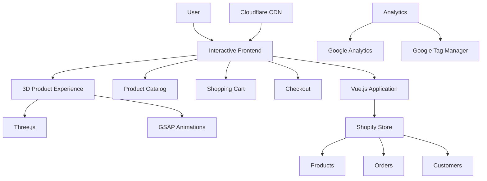

# Architecture Diagram

```mermaid
flowchart TD

A[User] --> B[Interactive Frontend]

B --> C[3D Product Experience]
B --> D[Product Catalog]
B --> E[Shopping Cart]
B --> F[Checkout]

C --> G[Three.js]
C --> H[GSAP Animations]

B --> I[Vue.js Application]

I --> J[Shopify Store]

J --> K[Products]
J --> L[Orders]
J --> M[Customers]

N[Analytics] --> O[Google Analytics]
N --> P[Google Tag Manager]

Q[Cloudflare CDN] --> B

```
